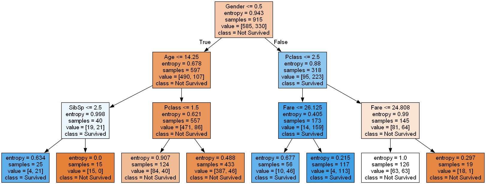

# Анализ выживаемости на Титанике

## Описание
Этот проект предназначен для анализа выживаемости пассажиров Титаника. Мы используем данные о пассажирах для обучения модели дерева решений, чтобы предсказать выживаемость. Проект включает загрузку и предварительную обработку данных, обучение модели дерева решений, оценку ее точности и визуализацию дерева решений.

## Функционал
- Загрузка данных из CSV-файла.
- Предварительная обработка данных, включая заполнение пропущенных значений и преобразование категориальных переменных.
- Обучение модели дерева решений с использованием обучающего набора данных.
- Оценка точности модели на обучающем и тестовом наборе данных.
- Визуализация дерева решений.

## Зависимости
Для работы программы необходимы следующие библиотеки:
- `pandas`
- `numpy`
- `sklearn`
- `graphviz`

## Установка и запуск проекта
1. Клонируйте репозиторий:
```
git clone https://github.com/Sogato/BDA-lab8.git
```
2. Создайте виртуальное окружение:
```
python -m venv env
```
3. Установите зависимости проекта:
```
pip install -r requirements.txt
```
4. Запустите программу:
```
python main.py
```
## Пример использования
После запуска программы в консоли будет отображена точность модели на обучающих и тестовых данных. В директории проекта будет сохранена визуализация дерева решений в формате PNG.

## Визуализация результатов

### Дерево решений


Этот график показывает структуру обученного дерева решений, используемого для предсказания выживаемости на Титанике. Узлы дерева показывают правила разделения, а листья — прогнозируемые классы.

---

Подготовлено в рамках учебного проекта. Все данные взяты из открытых источников и использованы исключительно в образовательных целях.

---

## Контрольные вопросы

### 1. В случаях подобных катастроф команда корабля должна следовать правилу «Женщины и дети в первую очередь» как руководство для того, кому должен быть предоставлен доступ к спасательным шлюпкам. Придерживались ли этого правила в данном случае?
На основе визуализации дерева решений, первое разделение происходит по полу (`Gender <= 0.5`), что означает, что пол был одним из определяющих факторов при принятии решения о выживании в симуляции модели. Узел, соответствующий женщинам (`Gender > 0.5`), далее делится на основе класса билета и цены билета, что указывает на высокие шансы на выживание у женщин, особенно у тех, кто путешествовал в 1-м и 2-м классах.

Дополнительное разделение по возрасту (`Age <= 14.25`) в левой части дерева указывает, что дети также имели более высокие шансы на выживание, независимо от их пола. Это согласуется с правилом "Женщины и дети в первую очередь".

Таким образом, основываясь на анализе дерева решений, можно сделать вывод, что правило "Женщины и дети в первую очередь" в некоторой степени соблюдалось на Титанике.

### 2. Какое значение было использовано для замены отсутствующих возрастов?
Судя по выводу кода 

```python
mean_age = df["Age"].mean()
print(mean_age)
```

Было использовано значение: 29.851834162679427

### 3. Из вашего анализа дерева решений, что описывает группу, в которой было больше всего смертей по количеству? В какой группе осталось больше всего выживших?

На основе изображения дерева решений:

Группа с наибольшим количеством смертей характеризуется следующим путем в дереве решений:

- Пол: мужской (Gender <= 0.5)
- Возраст: более 14.25 лет (Age > 14.25)
- Класс билета: 3-й класс (Pclass > 1.5)

Эта группа имеет атрибуты в верхней ветви дерева (коричневый прямоугольник в верхнем левом углу), и мы можем видеть, что большинство в этой группе не выжило, так как значение value = [490, 107] указывает на 490 пассажиров, которые не выжили, и 107 выживших.

Группа с наибольшим количеством выживших характеризуется следующим путем в дереве решений:
- Пол: женский (Gender > 0.5)
- Класс билета: 1-й или 2-й класс (Pclass <= 2.5)

Эта группа представлена в правой ветви дерева (синий прямоугольник в верхней правой части), и мы видим, что большинство пассажиров в этой группе выжило, с value = [95, 223], что указывает на 95 пассажиров, которые не выжили, и 223 выживших.

### 4. Какова была точность прогноза при выполнении части 2 работы?

Точность модели на тестовых данных: 0.7588832487309645

### 5. Какова была точность прогноза на обучающей и тестовой выборке данных при выполнении части 3 работы?

Training score = 0.8201530612244898
Testing score = 0.8053435114503816
